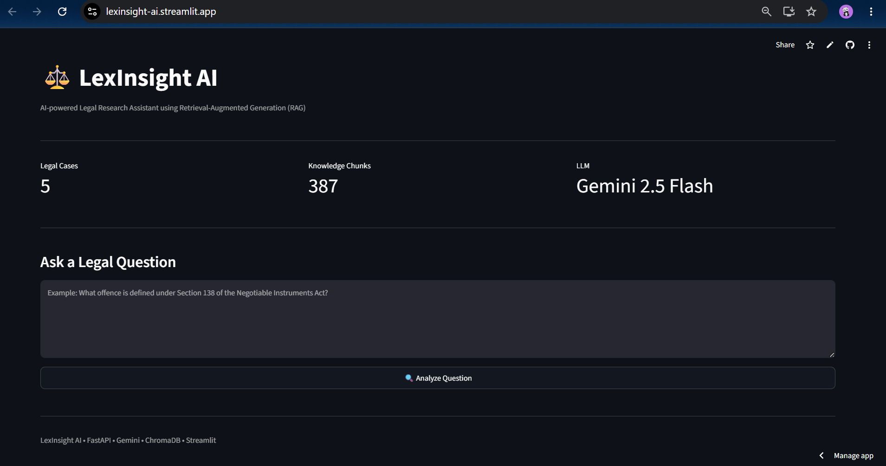
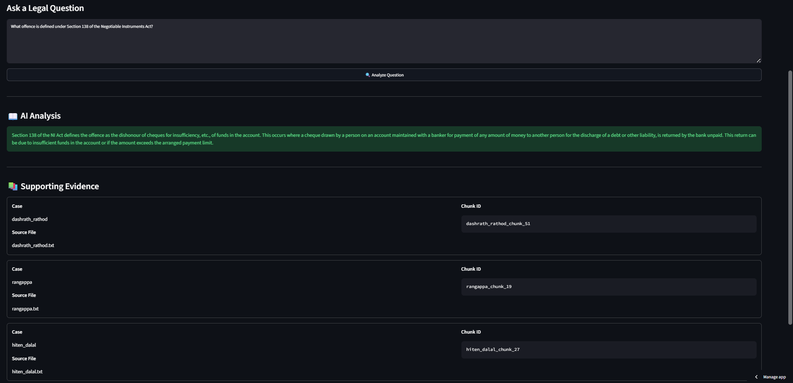
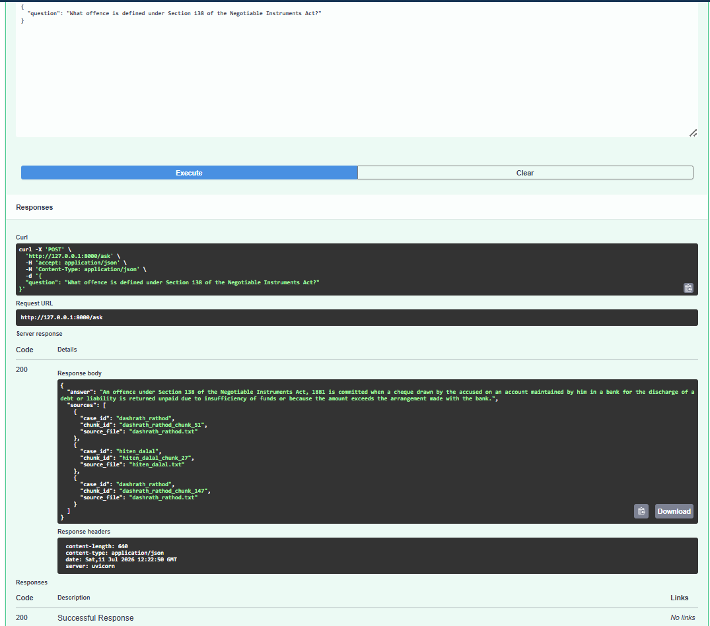
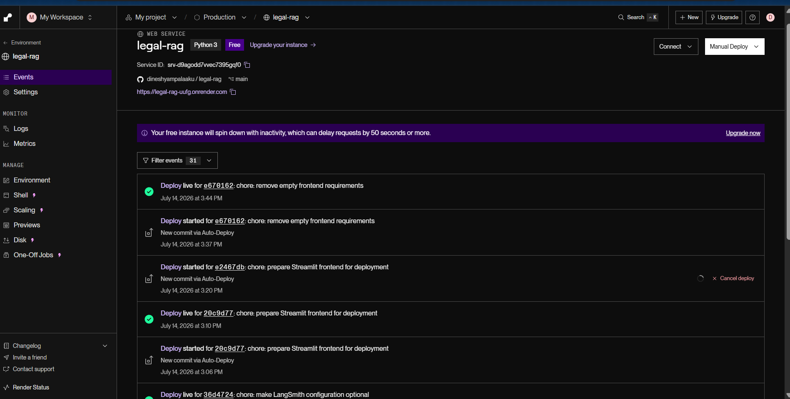

# ⚖️ Legal Document Intelligence System


## Table of Contents

- Overview
- Live Demo
- Features
- System Architecture
- Tech Stack
- Evaluation
- Application Preview
- Project Structure
- Getting Started
- Engineering Highlights
- Current Limitations
- Future Work


An AI-powered **Retrieval-Augmented Generation (RAG)** system for legal document analysis built using **Google Gemini, ChromaDB, FastAPI, and Streamlit**.

The system retrieves semantically relevant legal judgments from a vector database and generates **grounded answers with supporting source citations**, reducing hallucinations by restricting responses to the indexed legal corpus.

> **Version 1:** Uses a curated corpus of Indian legal judgments. Dynamic PDF upload and runtime indexing are planned for Version 2.

---

# 🚀 Live Demo

| Component | URL |
|-----------|-----|
| **Frontend (Streamlit)** | https://lexinsight-ai.streamlit.app |
| **Backend API (Render)** | https://legal-rag-uufg.onrender.com |
| **Swagger Documentation** | https://legal-rag-uufg.onrender.com/docs |

---

# ✨ Features

- 🔎 Retrieval-Augmented Generation (RAG)
- 📄 Semantic search over legal judgments
- 🤖 Grounded answer generation using Google Gemini
- 📚 Supporting source citations
- 🧠 ChromaDB vector database
- ⚡ FastAPI REST API
- 🌐 Streamlit web interface
- 📊 RAGAS evaluation pipeline
- 🚫 Graceful rejection when sufficient supporting context is unavailable
- ☁️ Cloud deployment (Render + Streamlit Community Cloud)

---

# 🏗️ System Architecture

```text
                     User
                       │
                       ▼
             Streamlit Frontend
                       │
              HTTP Request (REST)
                       │
                       ▼
               FastAPI Backend
                       │
                       ▼
              Query Embedding
        (Google Gemini Embeddings)
                       │
                       ▼
          ChromaDB Semantic Search
                       │
            Top-K Relevant Chunks
                       │
                       ▼
          Google Gemini LLM
                       │
                       ▼
      Grounded Answer + Source Citations
                       │
                       ▼
               Response to User
```

## RAG Workflow

1. User submits a legal question.
2. The query is converted into a vector embedding.
3. ChromaDB retrieves the most relevant document chunks.
4. Retrieved context is supplied to Gemini.
5. Gemini generates a grounded response.
6. The answer and supporting evidence are returned.

---

# 🛠️ Tech Stack

| Layer | Technology |
|--------|------------|
| Programming Language | Python 3.12 |
| Backend | FastAPI, Uvicorn |
| Frontend | Streamlit |
| LLM | Google Gemini 1.5 Pro |
| Embeddings | Gemini Embedding API |
| Vector Database | ChromaDB |
| Framework | LangChain Core |
| Text Processing | LangChain Text Splitters |
| Evaluation | RAGAS |
| Configuration | Pydantic Settings |
| Deployment | Render, Streamlit Community Cloud |
| Version Control | Git, GitHub |

---

# 📊 Evaluation

The retrieval pipeline was validated using **RAGAS** to verify that generated answers remained grounded in the retrieved legal judgments.
Evaluation was performed against a manually curated golden question–answer dataset derived from the indexed legal judgments.

### Smoke Test Results

| Metric | Score |
|---------|------:|
| Faithfulness | **1.00** |
| Context Recall | **1.00** |
| Answer Relevancy | **0.92** |

> These represent smoke-test evaluations performed during development to validate retrieval quality and grounding rather than a comprehensive benchmark.

---

# 📷 Application Preview

### Streamlit Interface



---

### AI Response



---

### FastAPI Swagger Documentation



---

### Backend Deployment (Render)



---

# 📁 Project Structure

```text
legal-rag/
│
├── data/
│   ├── chroma/
│   └── eval_sets/
│
├── frontend/
│
├── scripts/
│
├── src/
│   └── legal_rag/
│       ├── api/
│       ├── configs/
│       ├── embeddings/
│       ├── evaluation/
│       ├── generation/
│       ├── ingestion/
│       ├── retrieval/
│       └── rag_pipeline.py
│
├── README.md
├── findings.md
└── requirements.txt
```

---

# 🚀 Getting Started

## Clone the repository

```bash
git clone https://github.com/dineshyampalaaku/legal-rag.git

cd legal-rag
```

## Install dependencies

```bash
pip install -r requirements.txt
```

## Start the backend

```bash
uvicorn src.legal_rag.api.main:app --reload
```

## Start the frontend

```bash
streamlit run frontend/streamlit_app.py
```

---

# ⚙️ Engineering Highlights

- Designed an end-to-end Retrieval-Augmented Generation (RAG) pipeline for legal document question answering.
- Implemented semantic retrieval using Gemini Embeddings and ChromaDB.
- Built a modular FastAPI backend with a separate Streamlit frontend.
- Evaluated retrieval quality using RAGAS metrics.
- Deployed the complete application using Render and Streamlit Community Cloud.
- Implemented grounded responses with supporting source citations.
- Gracefully rejects out-of-domain questions to reduce hallucinations.

For detailed engineering decisions, experiments, debugging notes, and deployment findings, see **findings.md**.

---

# ⚠️ Current Limitations

- Version 1 demonstrates the complete RAG pipeline using a curated corpus of Indian legal    judgments. The focus of this version is on retrieval quality, answer grounding, evaluation, and deployment rather than large-scale document ingestion.
- Runtime PDF upload is not yet supported.
- Vector indexing is performed during preprocessing rather than at runtime.

---

# 🚧 Future Work

- PDF upload and automatic document ingestion
- Dynamic vector indexing
- Multi-document retrieval
- Source highlighting within documents
- Conversation history
- Hybrid retrieval and re-ranking
- Authentication and user workspaces

---

# 📄 License

This project was developed for educational and research purposes.

## Acknowledgements

This project was built as a hands-on exploration of Retrieval-Augmented Generation (RAG), semantic search, and LLM evaluation using modern open-source and cloud-based AI tooling.